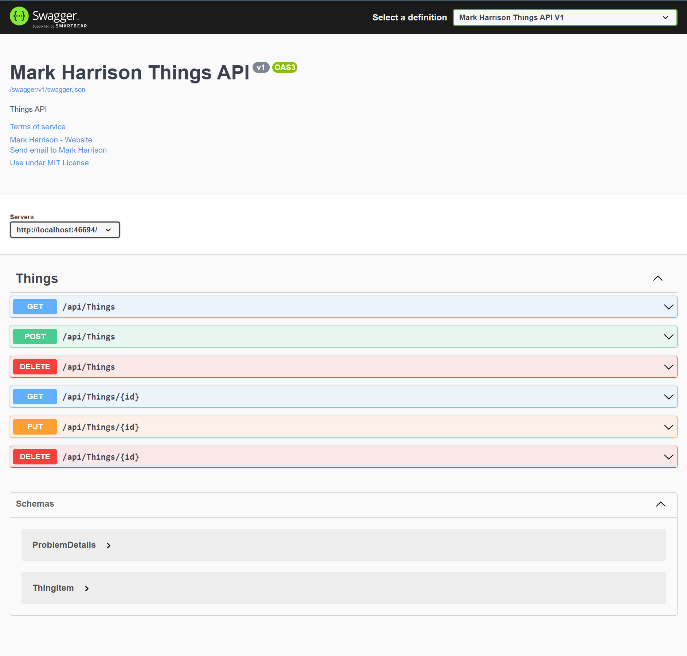

# ThingsAPI

Example response for AppDev Challenge <https://markharrison.io/appdev-challenge/>

Complete solution <https://markharrison.io/appdev-challenge/day2-complete>

## Configuration

Environment variables / configuration 

| Key          | Value     |  
|--------------|-----------| 
| ThingsStorageUseManagedIdentity | true if Managed Identity otherwise false  |  
| ThingsStorageAccountName | Storage Account Account Name - needed if Managed Identity = true |  
| ThingsDbConnectionString | Storage Account ConnectionString - needed if Managed Identity = false |  

For Managed Identity:

- Go to Azure Portal → Your App Service
- Navigate to Identity → System Assigned
- Set Status to On → Click Save

- Go to your Storage Account in Azure Portal
- Navigate to Access Control (IAM) → Add Role Assignment
- Choose Storage Table Data Contributor
- Assign it to your App Service's Managed Identity
 

## Infrastructure as Code

<https://github.com/markharrison/ThingsAPI/blob/main/infra/README.md>

## Package 

<https://github.com/markharrison/ThingsAPI/pkgs/container/thingsapi>